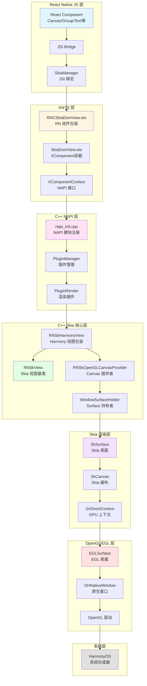
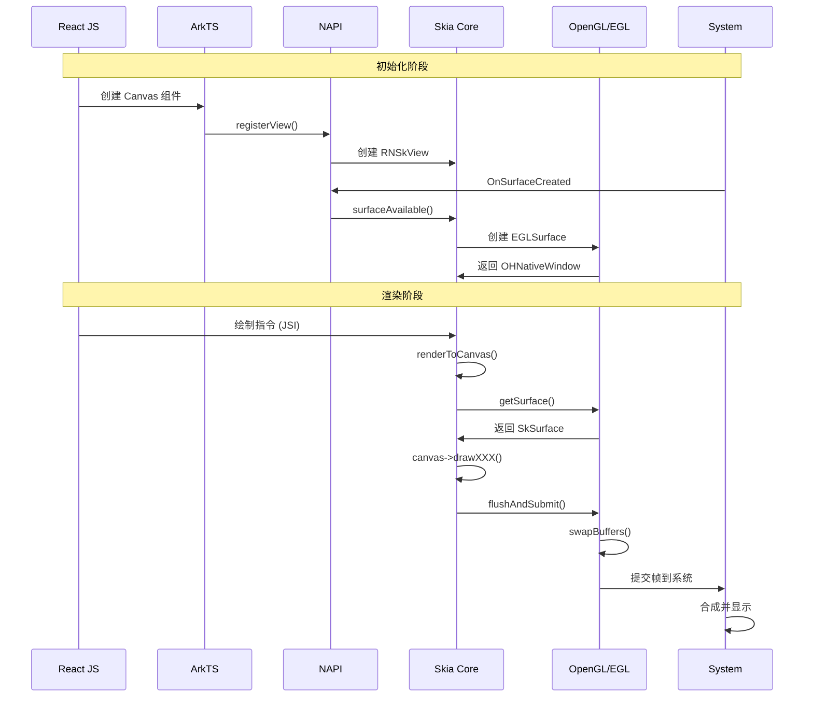
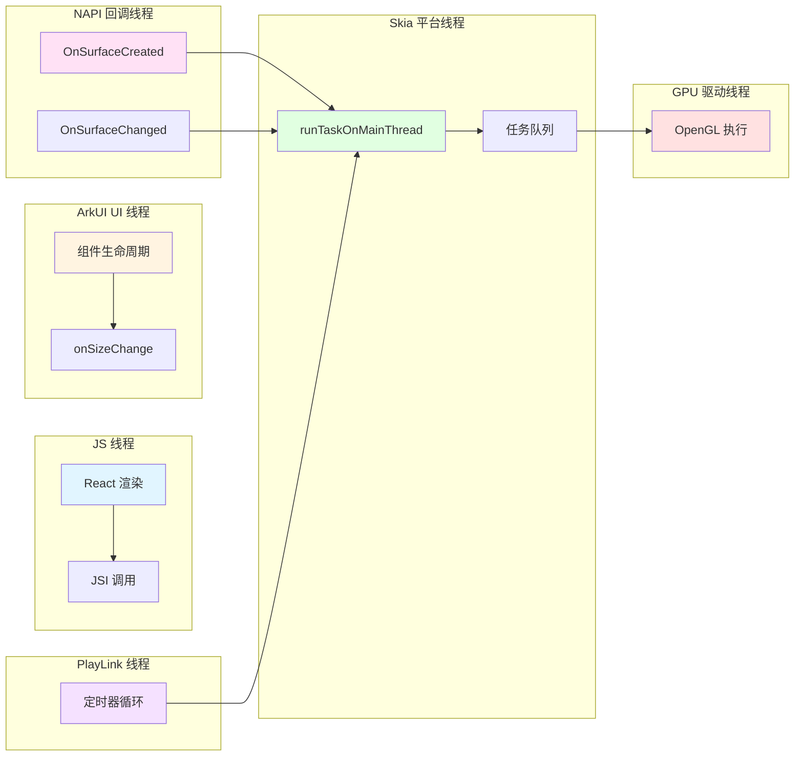
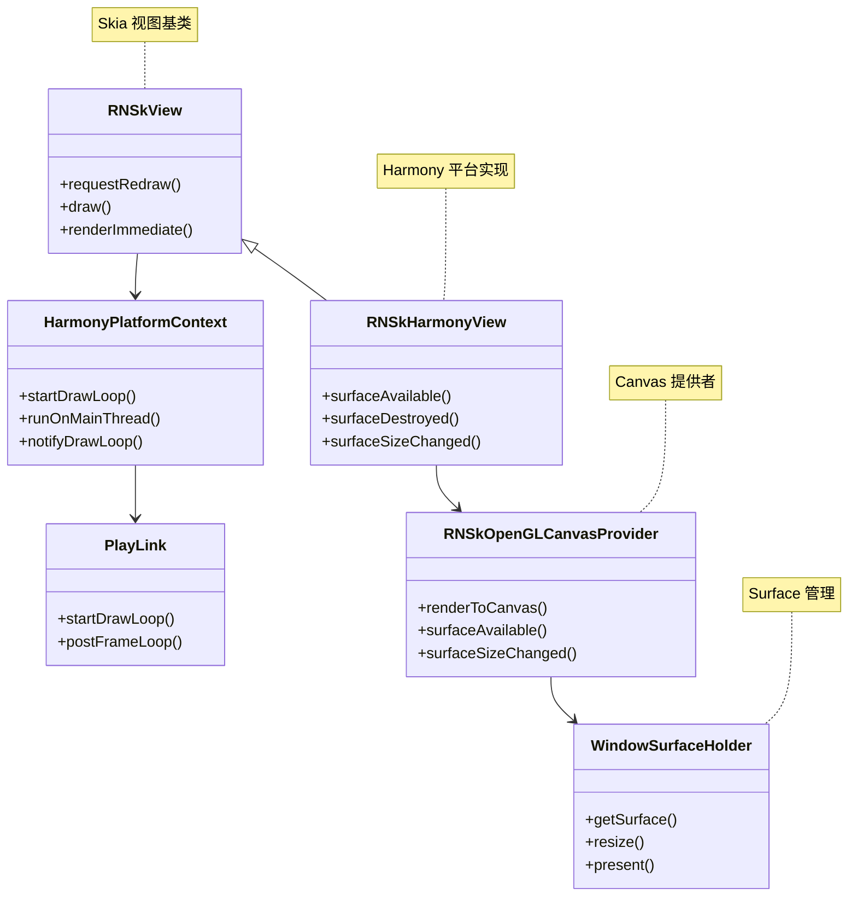

# react-native-skia 架构图

## 📊 快速概览（ASCII 图）

```
┌─────────────────────────────────────────────────────────────────┐
│                    React Native JS 层                           │
│  ┌──────────────┐  ┌──────────────┐  ┌──────────────┐         │
│  │   Canvas     │  │    Group     │  │    Text      │         │
│  │  组件        │  │   组件       │  │   组件       │         │
│  └──────┬───────┘  └──────┬───────┘  └──────┬───────┘         │
│         │                  │                  │                 │
│         └──────────────────┼──────────────────┘                 │
│                            │                                     │
│                    ┌───────▼────────┐                            │
│                    │  JSI Bridge    │                            │
│                    │  SkiaManager   │                            │
│                    └───────┬────────┘                            │
└────────────────────────────┼────────────────────────────────────┘
                              │
┌─────────────────────────────▼────────────────────────────────────┐
│                      ArkTS 层                                    │
│  ┌──────────────────┐  ┌──────────────────┐                    │
│  │ RNCSkiaDomView   │→ │  SkiaDomView     │                    │
│  │ (RN 包装层)      │  │  (XComponent)    │                    │
│  └──────────────────┘  └──────┬───────────┘                    │
│                                │                                  │
│                        ┌───────▼────────┐                        │
│                        │XComponentContext│                        │
│                        │   (NAPI 接口)   │                        │
│                        └───────┬────────┘                        │
└────────────────────────────────┼──────────────────────────────────┘
                                 │
┌────────────────────────────────▼──────────────────────────────────┐
│                    C++ NAPI 层                                    │
│  ┌──────────────┐  ┌──────────────┐  ┌──────────────┐          │
│  │ napi_init    │→ │PluginManager │→ │PluginRender  │          │
│  │ (模块注册)    │  │ (插件管理)   │  │ (渲染插件)   │          │
│  └──────────────┘  └──────┬───────┘  └──────┬───────┘          │
│                            │                  │                   │
│                            └────────┬─────────┘                   │
│                                     │                              │
└─────────────────────────────────────┼──────────────────────────────┘
                                      │
┌─────────────────────────────────────▼──────────────────────────────┐
│                  C++ Skia 核心层                                   │
│  ┌──────────────┐  ┌──────────────┐  ┌──────────────┐            │
│  │  RNSkView   │← │RNSkHarmonyView│→ │RNSkOpenGL    │            │
│  │ (视图基类)   │  │ (平台视图)    │  │CanvasProvider│            │
│  └──────┬───────┘  └──────┬───────┘  └──────┬───────┘            │
│         │                  │                  │                     │
│         └──────────────────┼──────────────────┘                     │
│                            │                                         │
│                    ┌───────▼────────┐                                │
│                    │WindowSurface   │                                │
│                    │Holder          │                                │
│                    └───────┬────────┘                                │
└────────────────────────────┼────────────────────────────────────────┘
                              │
┌─────────────────────────────▼──────────────────────────────────────┐
│                    Skia 渲染层                                      │
│  ┌──────────────┐  ┌──────────────┐  ┌──────────────┐            │
│  │  SkSurface   │→ │   SkCanvas   │→ │GrDirectContext│            │
│  │ (Skia 表面)  │  │ (Skia 画布)   │  │ (GPU 上下文)  │            │
│  └──────┬───────┘  └──────┬───────┘  └──────┬───────┘            │
│         │                  │                  │                       │
│         └──────────────────┼──────────────────┘                       │
└────────────────────────────┼──────────────────────────────────────────┘
                              │
┌─────────────────────────────▼──────────────────────────────────────┐
│                  OpenGL/EGL 层                                      │
│  ┌──────────────┐  ┌──────────────┐  ┌──────────────┐            │
│  │  EGLSurface  │→ │OHNativeWindow│→ │ OpenGL 驱动  │            │
│  │ (EGL 表面)   │  │ (原生窗口)    │  │ (GPU 驱动)   │            │
│  └──────┬───────┘  └──────┬───────┘  └──────┬───────┘            │
│         │                  │                  │                       │
│         └──────────────────┼──────────────────┘                       │
└────────────────────────────┼──────────────────────────────────────────┘
                              │
┌─────────────────────────────▼──────────────────────────────────────┐
│                        系统层                                       │
│                    HarmonyOS 合成器                                 │
│                        屏幕显示                                     │
└─────────────────────────────────────────────────────────────────────┘
```

---

## 📊 整体架构图（Mermaid）



---

## 🏗️ 分层架构详解

### 1. React Native JS 层

```
┌─────────────────────────────────────────┐
│  React Native JS 层                      │
├─────────────────────────────────────────┤
│  • Canvas 组件                           │
│  • Group, Text, Circle 等 Skia 组件     │
│  • JSI Bridge (JavaScript Interface)    │
│  • SkiaManager (JSI 绑定)                │
└─────────────────────────────────────────┘
```

**主要组件：**
- `Canvas` - Skia 画布组件
- `Group`, `Text`, `Circle`, `Line` 等 - Skia 图形组件
- `SkiaManager` - JSI 绑定，连接 JS 和 C++

**职责：**
- 声明式 UI 定义
- 通过 JSI 调用 C++ 层
- 管理组件生命周期

---

### 2. ArkTS 层

```
┌─────────────────────────────────────────┐
│  ArkTS 层 (HarmonyOS UI)                │
├─────────────────────────────────────────┤
│  • RNCSkiaDomView.ets                   │
│    └─ RN 组件包装层                      │
│  • SkiaDomView.ets                      │
│    └─ XComponent(SURFACE) 容器          │
│  • XComponentContext                    │
│    └─ NAPI 接口封装                     │
└─────────────────────────────────────────┘
```

**主要组件：**
- `RNCSkiaDomView.ets` - 从 RN descriptor 创建 SkiaDomView
- `SkiaDomView.ets` - 创建 `XComponent(SURFACE)` 容器
- `XComponentContext` - 封装 NAPI 调用

**职责：**
- 桥接 RN 和 HarmonyOS UI
- 管理 XComponent 生命周期
- 处理尺寸变化事件

---

### 3. C++ NAPI 层

```
┌─────────────────────────────────────────┐
│  C++ NAPI 层                            │
├─────────────────────────────────────────┤
│  • napi_init.cpp                        │
│    └─ NAPI 模块注册                      │
│  • PluginManager                        │
│    └─ 插件管理器                        │
│  • PluginRender                         │
│    └─ 渲染插件实现                       │
└─────────────────────────────────────────┘
```

**主要组件：**
- `napi_init.cpp` - 注册 NAPI 模块 `rnoh_skia`
- `PluginManager` - 管理 XComponent 实例
- `PluginRender` - 处理 XComponent 回调

**职责：**
- 桥接 ArkTS 和 C++ Skia 层
- 处理 XComponent 系统回调
- 管理 Surface 生命周期

---

### 4. C++ Skia 核心层

```
┌─────────────────────────────────────────┐
│  C++ Skia 核心层                        │
├─────────────────────────────────────────┤
│  • RNSkView                             │
│    └─ Skia 视图基类                     │
│  • RNSkHarmonyView                      │
│    └─ Harmony 平台视图包装              │
│  • RNSkOpenGLCanvasProvider             │
│    └─ OpenGL Canvas 提供者              │
│  • WindowSurfaceHolder                  │
│    └─ Surface 持有者                    │
│  • HarmonyPlatformContext               │
│    └─ 平台上下文                        │
└─────────────────────────────────────────┘
```

**主要组件：**
- `RNSkView` - Skia 视图基类，管理渲染循环
- `RNSkHarmonyView` - Harmony 平台特定实现
- `RNSkOpenGLCanvasProvider` - 提供 Canvas 渲染能力
- `WindowSurfaceHolder` - 管理 EGLSurface 和 SkSurface
- `HarmonyPlatformContext` - 平台上下文，管理线程和任务队列

**职责：**
- 管理 Skia 视图生命周期
- 提供 Canvas 渲染接口
- 处理 Surface 创建和销毁
- 管理渲染循环

---

### 5. Skia 渲染层

```
┌─────────────────────────────────────────┐
│  Skia 渲染层                            │
├─────────────────────────────────────────┤
│  • SkSurface                            │
│    └─ Skia 表面                         │
│  • SkCanvas                             │
│    └─ Skia 画布                         │
│  • GrDirectContext                      │
│    └─ GPU 直接上下文                    │
│  • Skia 图形库                          │
│    └─ 绘制引擎                          │
└─────────────────────────────────────────┘
```

**主要组件：**
- `SkSurface` - Skia 渲染表面
- `SkCanvas` - Skia 画布，执行绘制操作
- `GrDirectContext` - Skia GPU 上下文
- Skia 图形库 - 提供绘制能力

**职责：**
- 执行实际的图形绘制
- 管理 GPU 资源
- 优化渲染性能

---

### 6. OpenGL/EGL 层

```
┌─────────────────────────────────────────┐
│  OpenGL/EGL 层                         │
├─────────────────────────────────────────┤
│  • EGLSurface                           │
│    └─ EGL 表面                          │
│  • OHNativeWindow                      │
│    └─ HarmonyOS 原生窗口                │
│  • OpenGL 驱动                          │
│    └─ GPU 驱动                          │
└─────────────────────────────────────────┘
```

**主要组件：**
- `EGLSurface` - EGL 渲染表面
- `OHNativeWindow` - HarmonyOS 原生窗口句柄
- OpenGL 驱动 - GPU 驱动层

**职责：**
- 管理 OpenGL 上下文
- 提供 GPU 渲染能力
- 与系统窗口系统交互

---

## 🔄 数据流向图



---

## 🧵 线程模型架构图



---

## 📦 组件关系图



---

## 🔧 关键接口调用链

### 初始化流程

```
1. React JS 层
   └─ <Canvas> 组件渲染
       ↓
2. ArkTS 层
   └─ SkiaDomView.aboutToAppear()
       └─ XComponent 创建
           ↓
3. NAPI 层
   └─ PluginManager::Export()
       └─ 注册 XComponent 回调
           ↓
4. 系统回调
   └─ OnSurfaceCreated()
       └─ 获取 OHNativeWindow
           ↓
5. NAPI 层
   └─ PluginRender::RegisterView()
       └─ 绑定 nativeID ↔ RNSkView
           ↓
6. Skia 核心层
   └─ RNSkHarmonyView::surfaceAvailable()
       └─ RNSkOpenGLCanvasProvider::surfaceAvailable()
           └─ 创建 WindowSurfaceHolder
```

### 渲染流程

```
1. PlayLink 线程
   └─ 定时触发 (每 16.667ms)
       ↓
2. Skia 平台线程
   └─ HarmonyPlatformContext::notifyDrawLoop()
       └─ RNSkView::draw()
           ↓
3. Skia 核心层
   └─ RNSkOpenGLCanvasProvider::renderToCanvas()
       └─ WindowSurfaceHolder::getSurface()
           └─ 创建/获取 SkSurface
               ↓
4. Skia 渲染层
   └─ SkCanvas::drawXXX()
       └─ 执行绘制操作
           ↓
5. OpenGL 层
   └─ GrDirectContext::flushAndSubmit()
       └─ eglSwapBuffers()
           ↓
6. 系统层
   └─ 合成并显示
```

---

## 🎯 核心数据结构

### 1. WindowSurfaceHolder

```
WindowSurfaceHolder
├─ OHNativeWindow* _window      // 原生窗口
├─ EGLSurface _glSurface        // EGL 表面
├─ sk_sp<SkSurface> _skSurface  // Skia 表面
├─ int _width                   // 宽度
└─ int _height                  // 高度
```

### 2. RNSkOpenGLCanvasProvider

```
RNSkOpenGLCanvasProvider
├─ std::unique_ptr<WindowSurfaceHolder> _surfaceHolder
└─ std::shared_ptr<RNSkPlatformContext> _platformContext
```

### 3. HarmonyPlatformContext

```
HarmonyPlatformContext
├─ std::unique_ptr<PlayLink> playLink
├─ std::thread mainThread
├─ std::queue<std::function<void()>> taskQueue
└─ std::mutex taskMutex
```

---

## 📝 总结

### 架构特点

1. **分层清晰**：JS → ArkTS → NAPI → Skia → OpenGL → 系统
2. **职责明确**：每层负责特定功能
3. **异步处理**：多线程协作，保证性能
4. **平台抽象**：通过 PlatformContext 抽象平台差异

### 关键设计模式

- **桥接模式**：JS ↔ ArkTS ↔ C++
- **观察者模式**：PlayLink 定时触发渲染
- **工厂模式**：Surface 创建
- **策略模式**：不同平台的实现

---

**文档版本**: 1.0  
**最后更新**: 2025-01-XX  
**维护者**: AI Assistant
